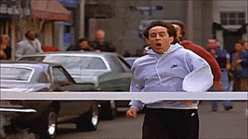

# ArcGIS JS API 3.x widget development!

## Widget structure

- index.html
- WikiWidget
  - css
    - WikiWidget.css
  - images
    - wikipedia_32.png (symbol)
  - nls
    - WikiWidget.js
  - support
    - wikiHelper.js
  - templates
    - WikiWidget.html

## Widget setup

### Widget stylesheet

Setup a file for styling our widget!

**WikiWidget.css**

``` html
<link rel="stylesheet" href="WikiWidget/css/WikiWidget.css">
```

### Social media icons

Icon font used to display the Wikipedia logo in our app.

[Social Media Icons](http://www.socicon.com/chart.php)

```html
<link href="https://file.myfontastic.com/n6vo44Re5QaWo8oCKShBs7/icons.css" rel="stylesheet">
```

### Position widget CSS

Place the widget in our page.

```css
    .esri-wikipedia {
      position: absolute;
      top: 92px;
      left: 15px;
      z-index: 2;
    }
```

### Module package setup

Setup the AMD loader to load our widget using a named package.

```js
    var dojoConfig = {
      // The locationPath logic below may look confusing but all its doing is 
      // enabling us to load the api from a CDN and load local modules from the correct location.
      packages: [{
        name: "widgets",
        location: packagePath + '/WikiWidget'
      }]
    };
```

### Add HTML to place widget

Place our widget in the DOM.

```html
<div id="WikiWidget"></div>
```

### Require widget module

Require our widget on our page.

```js
"widgets/WikiWidget",
```

``` js
WikiWidget
```

### Initialize widget

```js
      wikiWidget = new WikiWidget({
        map: map
      }, "WikiWidget");
      wikiWidget.startup();
```

[](http://localhost/git/uc-2016-widgets-101/demo/3x)

## Create a bare-bones widget

Add the simple bare bones widget code.

```js
define([
  "dijit/_WidgetBase"
], function (
  _WidgetBase
) {

  return _WidgetBase.createSubclass({

    // widget magic here! °˖✧◝(⁰▿⁰)◜✧˖°
    
    constructor: function(){
      console.log("hello world!");
    }

  });

});
```

[](http://localhost/git/uc-2016-widgets-101/demo/3x)

## Support file for Wikipedia

To simplify our demo we moved Wikipedia logic into a separate module.

```js
  "./support/wikiHelper",
```

```js
  wikiHelper,
```

## Add widget NLS and HTML

We'll separate our widget's HTML and language strings into separate files.

```js
  "dojo/i18n!./nls/WikiWidget",

  "dojo/text!./templates/WikiWidget.html"
```

```js
  i18n,
  templateString,
```

## Place HTML in template file

Add temporary HTML for display.

```html
<div>Hello UC!</div>
```

## Setup NLS file

Add empty i18n string file.

```js
define({
  root: ({
  })
});
```

## Add TemplatedMixin

```js
  "dijit/_TemplatedMixin",
```

```js
  _TemplatedMixin
```

## Widget extends templated mixin

```js
return _WidgetBase.createSubclass([_TemplatedMixin], {
```

## Add Template to widget

```js
templateString: templateString,
```

[](http://localhost/git/uc-2016-widgets-101/demo/3x)

## Add final widget dependencies

```js
  "dijit/a11yclick",

  "dojo/_base/array",
  "dojo/_base/lang",

  "dojo/dom-attr",
  "dojo/dom-class",
  "dojo/dom-construct",
  "dojo/dom-style",
  "dojo/on"
```

```js
  a11yclick,
  array, lang,
  domAttr, domClass, domConstruct, domStyle, on
```

## Add CSS Object + Base class

### CSS Object used to organize all our CSS class names

```js
  var CSS = {
    // button
    base: "esri-wikipedia",
    active: "esri-wikipedia--active",
    icon: "esri-icon socicon-wikipedia",

    // panel
    panel: "esri-wikipedia__panel",
    panelOpen: "esri-wikipedia__panel--open",
    loading: "esri-wikipedia__panel--loading",
    title: "esri-wikipedia__title",
    refresh: "esri-wikipedia__refresh",
    refreshIcon: "esri-icon-refresh",
    close: "esri-wikipedia__close esri-icon-close",
    scroller: "esri-wikipedia__list-scroller",

    // list
    list: "esri-wikipedia__list",
    message: "esri-wikipedia__message",
    item: "esri-wikipedia__result",
    image: "esri-wikipedia__result-image",
    noImage: "esri-wikipedia__result-image--none",
    header: "esri-wikipedia__header",
    footer: "esri-wikipedia__footer"
  };
```

### Define the widget's root class name

```js
baseClass: CSS.base,
```

## Declared class for 3x

```js
declaredClass: "esri.dijit.WikiWidget",
```

## Setup lifecycle + sections

```js
    //--------------------------------------------------------------------------
    //
    //  Lifecycle
    //
    //--------------------------------------------------------------------------

    constructor: function () {
      
    },

    postCreate: function () {
      
    },

    //--------------------------------------------------------------------------
    //
    //  Variables
    //
    //--------------------------------------------------------------------------

    //--------------------------------------------------------------------------
    //
    //  Properties
    //
    //--------------------------------------------------------------------------

    //--------------------------------------------------------------------------
    //
    //  Private Methods
    //
    //--------------------------------------------------------------------------
```

## Add widget properties

Widget properties can be configurable or read only.

```js
    //----------------------------------
    //  active
    //----------------------------------

    /**
     * @readonly
     */
    active: null,

    _getActiveAttr: function () {
      return this._active;
    },

    //----------------------------------
    //  map
    //----------------------------------

    map: null,

    //----------------------------------
    //  maxResults
    //----------------------------------

    maxResults: MAX_RESULTS,

    _setMaxResultsAttr: function (value) {
      value = value > MAX_RESULTS ? MAX_RESULTS :
              value < MIN_RESULTS ? MIN_RESULTS :
              value;

      this._set("maxResults", value);
    },
```

## Add widget constants for result queries

```js
  var MIN_RESULTS = 1;
  var MAX_RESULTS = 10;
```

## Add private widget variables

```js
    _css: CSS,

    _i18n: i18n,

    _active: false,

    _resultGraphics: null,
```

## Set constructor variable for empty result graphics

```js
this._resultGraphics = [];
```

## Add CSS

[CSS Source](https://github.com/driskull/uc-2016-widgets-101/blob/gh-pages/finished/3x/WikiWidget/css/WikiWidget.css)

## Add HTML

[HTML Source](https://github.com/driskull/uc-2016-widgets-101/blob/gh-pages/finished/3x/WikiWidget/templates/WikiWidget.html)


## Add internationalization (i18n)

[i18n Source](https://github.com/driskull/uc-2016-widgets-101/blob/gh-pages/finished/3x/WikiWidget/nls/WikiWidget.js)

[](http://localhost/git/uc-2016-widgets-101/demo/3x)

Widget should display correctly but not do anything yet.

## Open and close panel functions

```js
    _openPanel: function () {
      domClass.add(this._panelNode, CSS.panelOpen);
    },

    _closePanel: function () {
      domClass.remove(this._panelNode, CSS.panelOpen);
    },
```

[](http://localhost/git/uc-2016-widgets-101/demo/3x)

```js
wikiWidget._openPanel();
```

```js
wikiWidget._closePanel();
```

## WikiHelper functions

- findNearbyItems
- addResultGraphics
- clearResultGraphics


## Fetch function

```js
    _fetchAndUpdate: function () {
      var self = this,
          map  = this.map;
      
      wikiHelper.clearResultGraphics({
        map: map,
        results: this._resultGraphics
      });
      
      this._showLoadingStatus();

      return wikiHelper.findNearbyItems({
          map: map,
          maxResults: this.maxResults
        })
        .then(lang.hitch(this, this._updateList))
        .then(function(results) {
          self._resultGraphics = wikiHelper.addResultGraphics({
            map: map,
            results: results
          });
        })
        .always(lang.hitch(this, this._hideLoadingStatus));
    },
```

## Show & hide loading status

```js
    _showLoadingStatus: function () {
      domClass.add(this._panelNode, CSS.loading);

      domConstruct.create("li", {
        className: CSS.message,
        innerHTML: i18n.fetchingResults
      }, this._resultListNode, "only");
    },

    _hideLoadingStatus: function () {
      domClass.remove(this._panelNode, CSS.loading);
    },
```


## Update panel list

```js
    _updateList: function (items) {
      var fragment = document.createDocumentFragment(),
          entry, image, title;

      if (items.length === 0) {
        domConstruct.create("li", {
          className: CSS.message,
          textContent: i18n.noResults
        }, fragment);
      }
      else {
        array.forEach(items, function (item) {
  
          entry = domConstruct.create("li", {
            tabindex: 0,
            "data-id": item.id,
            className: CSS.item
          }, fragment);
  
          image = domConstruct.create("span", {
            title: item.title,
            className: CSS.image
          }, entry);
  
          title = domConstruct.create("span", {
            textContent: item.title
          }, entry);

          if (item.image) {
            domStyle.set(image, "background-image", "url(" + item.image + ")");
          }
          else {
            domClass.add(image, CSS.icon);
          }

        });
      }

      domConstruct.place(fragment, this._resultListNode, "only");

      return items;
    }
```


## Toggle function

```js
    _toggle: function () {
      this._active = !this._active;

      if (this._active) {
        this._openPanel();
        this._fetchAndUpdate();
      }
      else {
        wikiHelper.clearResultGraphics({
          map: this.map,
          results: this._resultGraphics
        });
        this._closePanel();
      }

      domClass.toggle(this.domNode, CSS.active, this._active);
    },
```

## Event listeners

```js
      var self = this;

      this.inherited(arguments);

      domConstruct.place(this._panelNode, this.map.root);

      this.own(
        on(this.domNode, a11yclick, lang.hitch(this, this._toggle)),
        on(this._closeNode, a11yclick, lang.hitch(this, this._toggle)),
        on(this._resultListNode, on.selector("[data-id]", a11yclick), function () {
          var id = domAttr.get(this, "data-id");
  
          wikiHelper.highlightGraphic({
            id: id,
            map: self.map,
            results: self._resultGraphics
          });
        }),
        on(this._refreshNode, a11yclick, lang.hitch(this, this._fetchAndUpdate))
      );
```

[](http://localhost/git/uc-2016-widgets-101/demo/3x)


## You've created a widget!

[](http://localhost/git/uc-2016-widgets-101/demo/3x)
